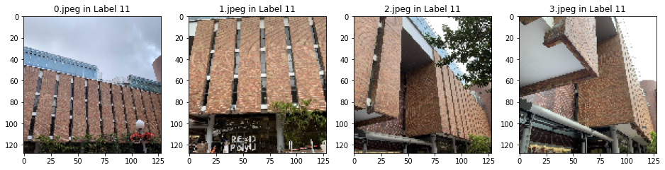
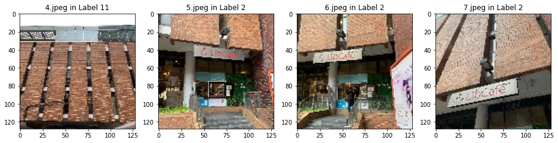
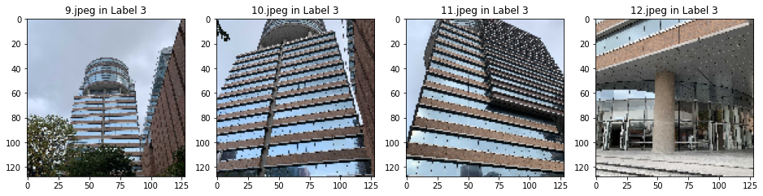
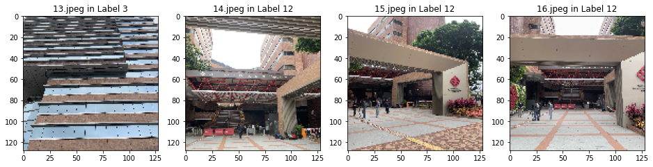
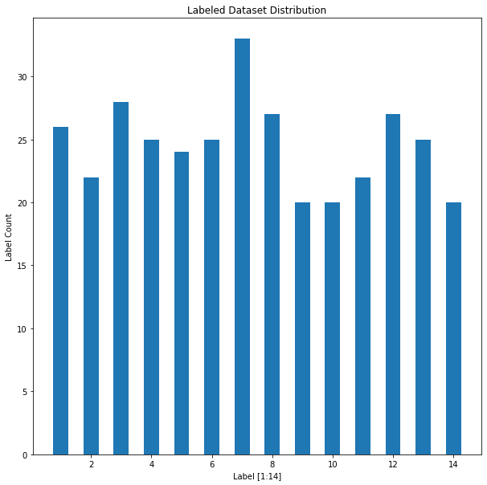
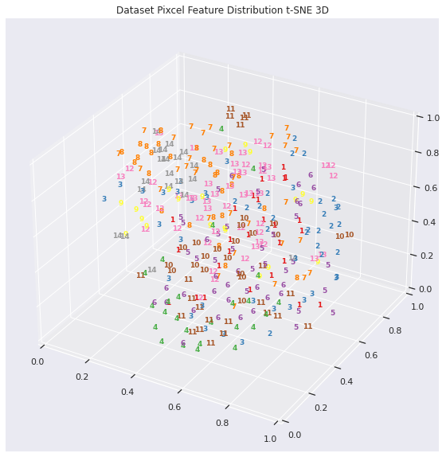
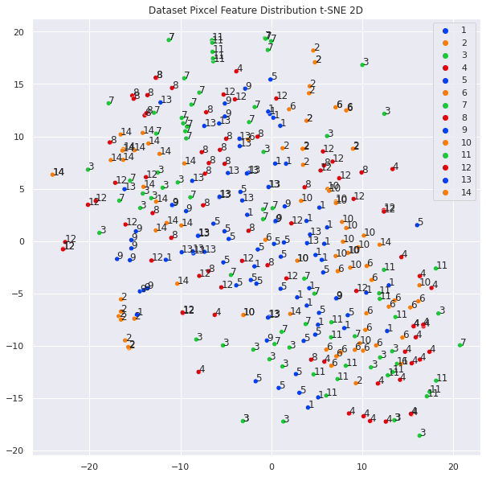

> [!CAUTION]
> ***Please carefully read the [Disclaimer of Liability](#disclaimer-of-liability) below first.***  
> All materials in this archive are for reference only. The actual one may vary. 

# Campus_Tour_Guide

A Campus Tour Guide with On-campus Landmarks Recognition System by Convolutional Neural Network Models

## 1. INTRODUCTION

This project presents the design and implementation of a ***On-campus Landmarks Recognition System (OLRS)*** , which can be used to find information of on-campus (PolyU) landmarks, including building names, location on map, and other useful data, especially for campus visitors' usage.

The project will introduce the design and implementation of the **OLRS back-end model and algorithm** of the system, as well as the examples of **OLRS front-end user interface** applied the algorithm in real campus scenario.

The OLRS algorithm model currently includes **14 labels** on landmark buildings inside The Hong Kong Polytechnic University main campus, including,
- 1: Communal Building; 2: LibCafe; 3: Li Ka Shing Tower; 
- 4: Jockey Club Innovation Tower; 5: Lee Shau Kee Building; 6: Block VA; 
- 7: Logo Square; 8: Jockey Club Auditorium; 9: Global Student Hub; 
- 10: Industrial Centre; 11: Pao Yue-Kong Library; 12: Main Entrance; 13: Block X Sport Center; 14: Lawn;

---

## 2. Dataset Collection and Processing

I currently have **14 labels** on landmark buildings inside PolyU main campus. I have collected around $25$ images for each label, and the total number of images is $344$. The self-collected images are collected from the real campus by students, and images are processed to be **cut into square shape**, convert to **gray scale**, and **resized** to $128 \times 128$ pixels.

    

    

    

    

    

    

    

---

## 3 Model Design

### 3.1 CNN Classification Model

Regarding the **Image Classification Task**, I have build **two different CNN models** for training and test:
`Simple CNN`: **1 Convolutional Layer** and **2 Fully Connected Layers**, and 
`CNN`: **2 Convolutional Layers** and **3 Fully Connected Layers**. 
The overall structure of the `Simple CNN` and `CNN` are very similar, the only difference is the number of convolutional layers and fully connected layers. I choose the **kernel size of $5\times 5$** as the filter in the convolutional layer, with stride of $1\times 1$ and padding of $2\times 2$. The **ReLU** is chosen as the activation function. **Max pooling** is used to select the maximum value in a region before outputting from a convolutional layer.

### 3.2 VGG16 Feature Retrieval Model

#### I. *Model Design and Train*

Regarding as the **Image Classification Task**, I use a **pre-trained VGG16 model** to extract the output features of the all images by flattening the feature maps of the convolutional layers as **feature vectors**.

#### II. *Testing*

Given a query image, I extract the feature vector of the query image by the pre-trained VGG16 model, and then use the **cosine similarity** to calculate the similarity between the VGG feature vector of query image and VGG feature vector of all other image Then get the **most similar image** with **highest similarity**, then I assign the label of the **most similar image** to the query image as its output label.

---

## User Manual

### Preparation

1. Python version: `3.9.16`
2. Make sure following package are install for python3:
   - `OpenCV`, `Flask`, `numpy`, `pandas`, `sklearn`, `torch`, `torchvision`, `torchaudio`, `matplotlib,`, `seaborn`

### File Checklist

The repo contains following files:
- [x] 1. `OLRS_App.py`, Application program for the OLRS;
- [x] 2. `OLRS_Algo.py`, Algorithm program for the OLRS;
- [x] 3. `OLRS_Model_Train.ipynb`, Model Training program for the OLRS;
- [x] 4. `modelCNN.pth`, saved trained model for the OLRS;
- [x] 5. `label-map.csv`, label map for the OLRS;
- [x] 6. `polyuPics` folder, containing all the campus image dataset;
- [x] 7. `static` folder, and
- [x] 8. `template` folder, containing all the static files and template files for the OLRS web page elements;

---

### How to run and use the Campus-tour Guide Application?

**Easiest one-step way**: 
- Visiting the web page: [https://plus.ultrafish.io/campus/](https://plus.ultrafish.io/campus/);
- Follow the instruction on the web page (step1, step2);
- I have already deployed the application on my server, which can be accessed by the link above.

or

**Run the Application locally**:
- Run the `OLRS_App.py` file by
  `python3 OLRS_App.py`
- Check your terminal says `Running on http://127.0.0.1:5000/ (Press CTRL+C to quit)`;
- Use your browser to visit the web page on your localhost: [http://127.0.0.1:5000/](http://127.0.0.1:5000/);
- follow the instruction on the web page (step1, step2);
- Press `CTRL+C` in terminal to quit.

---

### How to train and test models?

> **Note**:
> 1. I build, train and test the models on the **Colab** instead of my local machine due to incompatibility of Apple M1 chip and PyTorch.
> 2. Therefore, I provide the `OLRS_Model_Train.ipynb` file for you to train and test the models on **Colab**.
> 3. If you are using Colab, please make sure you have uploaded following files to your Colab (Google Drive), and set the `workspace` correctly:
> - 5. `OLRS_Model_Train.ipynb`
> - 7. `label-map.csv`
> - 8. `polyuPics` folder
> 4. The training process may **take a long long time**, please be patient.

1. Carefully read the **Note** above;
2. Open the `OLRS_Model_Train.ipynb` file on Colab or local machine;
3. Make sure 3 files mentioned in **Note** are uploaded to Colab (Google Drive);
4. You may collect the dataset by yourself, by following the file structure in the `polyuPics` folder, and the labelling in the `label.csv` file in `polyuPics` folder;
5. Make sure the `workspace` is set correctly;
6. Run all cells in the `OLRS_Model_Train.ipynb` file;

---

## Disclaimer of Liability

**The material and information contained on this website is for general information, reference, and self-learning purposes only. You should not rely upon the material or information on the website as a basis for making any academic, business, legal or any other decisions. You should not copy any material or information on the website into any of your academic, business, legal or any other non-private usages. ZHANG Wengyu will not be responsible for any consequences due to your violations.**

Whilst ZHANG Wengyu endeavours to keep the information up to date and correct, ZHANG Wengyu makes no representations or warranties of any kind, express or implied about the completeness, accuracy, reliability, suitability or availability with respect to the website or the information, products, services or related graphics contained on the website for any purpose. Any reliance you place on such material is therefore strictly at your own risk.

ZHANG Wengyu will not be liable for any false, inaccurate, inappropriate or incomplete information presented on the website.

Although every effort is made to keep the website up and running smoothly, due to the nature of the Internet and the technology involved, ZHANG Wengyu takes no responsibility for and will not be liable for the website being temporarily unavailable due to technical issues (or otherwise) beyond its control or for any loss or damage suffered as a result of the use of or access to, or inability to use or access this website whatsoever.

Certain links in this website will lead to websites which are not under the control of ZHANG Wengyu. When you activate these you will leave ZHANG Wengyu's  website. ZHANG Wengyu has no control over and accepts no liability in respect of materials, products or services available on any website which is not under the control of ZHANG Wengyu.

To the extent not prohibited by law, in no circumstances shall ZHANG Wengyu be liable to you or any other third parties for any loss or damage (including, without limitation, damage for loss of business or loss of profits) arising directly or indirectly from your use of or inability to use, this site or any of the material contained in it.
